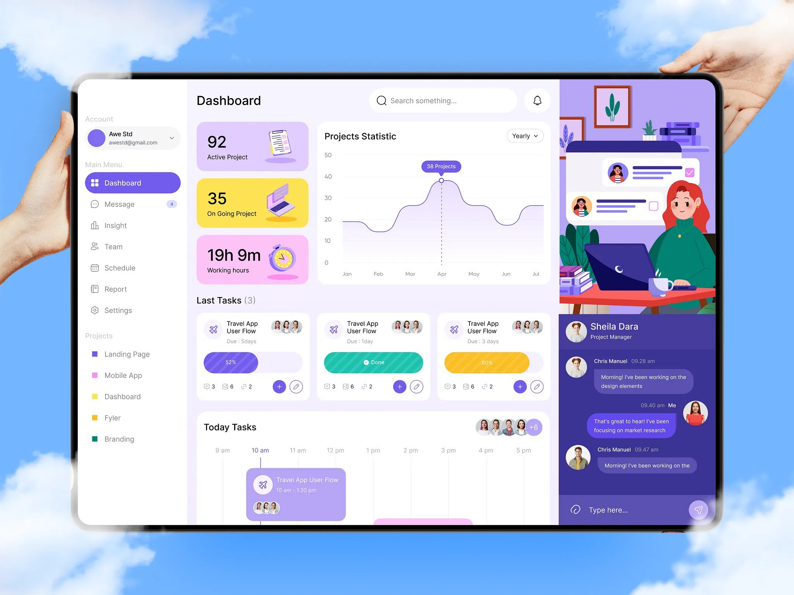

# Task Hub - Task Management Dashboard

This project is a task management dashboard application built with Next.js. It features a sidebar navigation, dashboard with statistics and charts, task lists with filtering and sorting, real-time chat, authentication, and theme switching. The app uses mock data initially and integrates with Supabase for backend services, including authentication, database, and real-time updates. Theme preferences, authentication state, and other user data are persisted using local storage or cookies.

## Features

- **Dashboard Overview**: Displays key metrics like Active Projects, Ongoing Projects, and Working Hours, along with a Projects Statistic chart using Recharts.
- **Task Management**: View, add, edit, and delete tasks with details such as title, status, progress, due date, and participants. Includes filtering by status, sorting by deadline, and a timeline view.
- **Real-Time Chat**: Integrated chat interface for messaging with real-time updates via Supabase.
- **Authentication**: Login form with email and password, protected routes, and logout functionality. Uses Supabase for server-side auth.
- **Theme Switching**: Supports light and dark themes, stored in local storage.
- **API Integration**: Fetches and mutates data from Supabase, including tasks, statistics, and chat messages.
- **Modals and Forms**: Task editing modal with validation using React Hook Form and Zod.
- **Loading and Error Handling**: Skeletons for loading states and error notifications.
- **Responsive Design**: Adaptive layout for various screen sizes.
- **Animations**: Smooth animations using Framer Motion.

## Technologies Used

- **Next.js**: For server-side rendering and routing.
- **React**: A JavaScript library for building user interfaces.
- **Supabase**: For backend services, authentication, database, and real-time features.
- **Tanstack React Query**: For data fetching and caching.
- **React Hook Form and Zod**: For form handling and validation.
- **Recharts**: For charting project statistics.
- **Next Themes**: For theme management.
- **Framer Motion**: For animations.
- **Lucide React**: For icons.
- **Radix UI and Shadcn UI**: For accessible UI components (dialogs, popovers, selects, etc.).
- **Tailwind CSS**: For styling and responsive design.
- **TypeScript**: For type-safe development.

## Setup and Installation

### Prerequisites

To run this project, you need to have the following installed:

- Node.js
- npm (Node package manager)

### Steps

1. **Clone the repository**:

   ```bash
   git clone https://github.com/samtoroyan22/task-hub.git
   cd task-hub
   ```

2. **Install dependencies**:

   ```bash
   npm install
   ```

3. **Set up Supabase**: Create a Supabase project and update environment variables with your project URL and API keys.

4. **Run the development server**:

   ```bash
   npm run dev
   ```

5. Open the application in your browser by navigating to `http://localhost:3000`.

## Screenshots

Design reference: 


## Troubleshooting

- If real-time features (e.g., chat) do not work, verify Supabase connection and subscriptions.
- If themes do not switch properly, check local storage access and Next Themes setup.
- If API data is not fetching, ensure Supabase credentials are correct and test queries.
- For form validation issues, review Zod schemas and React Hook Form integration.
- If charts do not render, confirm Recharts dependencies and data formats.
- For adaptive issues, test on different screen sizes and check Tailwind CSS media queries.
- If local storage data is not persisting, check for browser restrictions (e.g., private mode).

## License

This project is licensed under the MIT License.  
Copyright (c) 2025 Samvel Toroyan

# Task Hub - Дашборд для Управления Задачами

Этот проект представляет собой дашборд для управления задачами, построенный с использованием Next.js. Он включает боковую панель навигации, дашборд со статистикой и графиками, списки задач с фильтрацией и сортировкой, чат в реальном времени, аутентификацию и переключение тем. Приложение сначала использует мок-данные, а затем интегрируется с Supabase для бэкенда, включая аутентификацию, базу данных и обновления в реальном времени. Предпочтения темы, состояние аутентификации и другие данные пользователя сохраняются в локальном хранилище или куках.

## Особенности

- **Обзор дашборда**: Отображает ключевые метрики, такие как Active Projects, Ongoing Projects и Working Hours, а также график Projects Statistic с использованием Recharts.
- **Управление задачами**: Просмотр, добавление, редактирование и удаление задач с деталями, такими как заголовок, статус, прогресс, срок и участники. Включает фильтрацию по статусу, сортировку по дедлайну и вид timeline.
- **Чат в реальном времени**: Интегрированный интерфейс чата для обмена сообщениями с обновлениями в реальном времени через Supabase.
- **Аутентификация**: Форма логина с email и паролем, защищенные маршруты и функция выхода. Использует Supabase для серверной аутентификации.
- **Переключение тем**: Поддерживает светлую и тёмную темы, хранящиеся в локальном хранилище.
- **Интеграция API**: Получает и изменяет данные из Supabase, включая задачи, статистику и сообщения чата.
- **Модалки и формы**: Модалка редактирования задач с валидацией с использованием React Hook Form и Zod.
- **Обработка загрузки и ошибок**: Скелетоны для состояний загрузки и уведомления об ошибках.
- **Адаптивный дизайн**: Адаптивная вёрстка для различных размеров экранов.
- **Анимации**: Плавные анимации с использованием Framer Motion.

## Используемые технологии

- **Next.js**: Для серверного рендеринга и маршрутизации.
- **React**: Библиотека JavaScript для создания пользовательских интерфейсов.
- **Supabase**: Для бэкенда, аутентификации, базы данных и функций реального времени.
- **Tanstack React Query**: Для получения и кэширования данных.
- **React Hook Form и Zod**: Для обработки форм и валидации.
- **Recharts**: Для графиков статистики проектов.
- **Next Themes**: Для управления темами.
- **Framer Motion**: Для анимаций.
- **Lucide React**: Для иконок.
- **Radix UI и Shadcn UI**: Для доступных UI-компонентов (диалоги, поповеры, селекты и т.д.).
- **Tailwind CSS**: Для стилизации и адаптивного дизайна.
- **TypeScript**: Для типобезопасной разработки.

## Установка и настройка

### Требования

Для запуска этого проекта необходимо установить:

- Node.js
- npm (менеджер пакетов для Node.js)

### Шаги

1. **Клонировать репозиторий**:

   ```bash
   git clone https://github.com/samtoroyan22/task-hub.git
   cd task-hub
   ```

2. **Установить зависимости**:

   ```bash
   npm install
   ```

3. **Настроить Supabase**: Создайте проект в Supabase и обновите переменные окружения с URL проекта и API-ключами.

4. **Запустить сервер для разработки**:

   ```bash
   npm run dev
   ```

5. Откройте приложение в браузере, перейдя по адресу `http://localhost:3000`.

## Решение проблем

- Если функции реального времени (например, чат) не работают, проверьте подключение к Supabase и подписки.
- Если темы не переключаются правильно, убедитесь в доступе к local storage и настройке Next Themes.
- Если данные API не загружаются, убедитесь, что учетные данные Supabase верны, и протестируйте запросы.
- Для проблем с валидацией форм проверьте схемы Zod и интеграцию React Hook Form.
- Если графики не рендерятся, подтвердите зависимости Recharts и форматы данных.
- Для проблем с адаптивностью протестируйте на разных размерах экранов и проверьте медиа-запросы Tailwind CSS.
- Если данные локального хранилища не сохраняются, проверьте ограничения браузера (например, режим инкогнито).

## Лицензия

Этот проект лицензирован под лицензией MIT.  
Copyright (c) 2025 Samvel Toroyan
